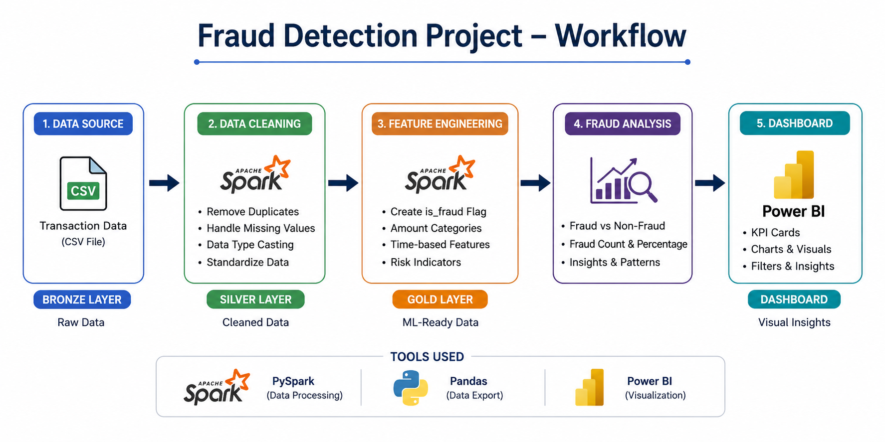

"# Fraud_detection" 
"# Fraud_detection" 


# Fraud Detection Data Engineering Project

## Overview
This project is an end-to-end Fraud Detection Data Engineering Pipeline built using PySpark, Pandas, and Power BI. The pipeline processes raw transaction data, performs data cleaning and feature engineering, and generates fraud analysis insights through an interactive dashboard.

The project follows a simple Bronze → Silver → Gold data architecture:

- Bronze Layer → Raw transaction data ingestion
- Silver Layer → Cleaned and transformed data
- Gold Layer → Fraud detection features and analytics-ready data

---

# Workflow Architecture



---

# Project Structure

```bash
fraud-detection-data-engineering/
│
├── data_lake/
│   ├── bronze/
│   │   └── raw_transactions.csv
│   │
│   ├── silver/
│   │   └── clean_transactions.csv
│   │
│   └── gold/
│       └── fraud_features.csv
│
├── spark_jobs/
│   ├── bronze_ingestion.py
│   ├── silver_cleaning.py
│   └── gold_features.py
│
├── dashboard/
│   └── fraud_dashboard.pbix
│
├── images/
│   └── workflow_diagram.png
│
├── requirements.txt
└── README.md
```

---

# Technologies Used

- PySpark
- Python
- Pandas
- Power BI
- CSV Data Processing

---

# Features

## Bronze Layer
- Reads raw transaction CSV data
- Handles schema ingestion
- Stores raw transactional records

## Silver Layer
- Removes duplicates
- Handles null values
- Performs data type casting
- Cleans transaction data

## Gold Layer
- Creates fraud detection features
- Generates fraud flags
- Creates amount categories
- Builds analytics-ready datasets

## Dashboard
- Fraud vs Non-Fraud Analysis
- Fraud Percentage KPI
- Transaction Category Analysis
- Interactive Power BI Visualisations

---

# Fraud Detection Logic

Transactions are marked as fraud based on transaction amount conditions.

Example:

```python
when(col("amount") > 5000, 1).otherwise(0)
```

---


# Power BI Dashboard

The Power BI dashboard provides:

- Fraud transaction insights
- Fraud percentage analysis
- Risk categorisation
- Interactive filtering and KPI tracking

---

# Sample Insights

- Total Fraud Transactions
- Fraud Percentage
- High Risk Transaction Categories
- Time-based Fraud Patterns

---

# Future Improvements

- Real-time streaming using Kafka
- ML-based fraud prediction model
- Cloud deployment
- Airflow orchestration
- Database integration

---

# Author

Harish M

---

# License

This project is for educational and portfolio purposes.
